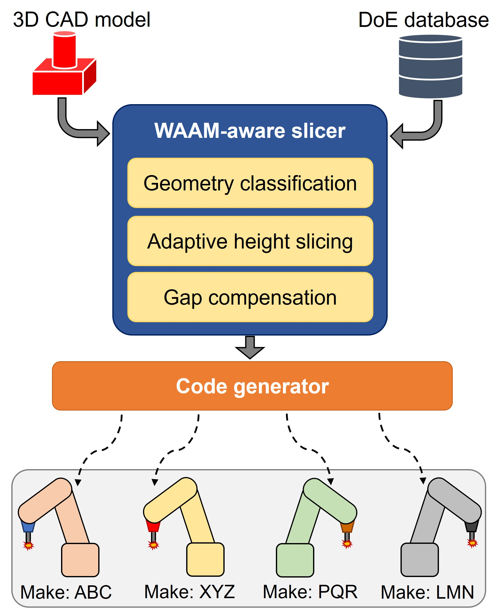
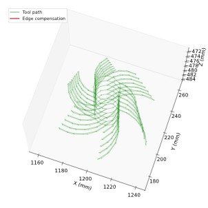
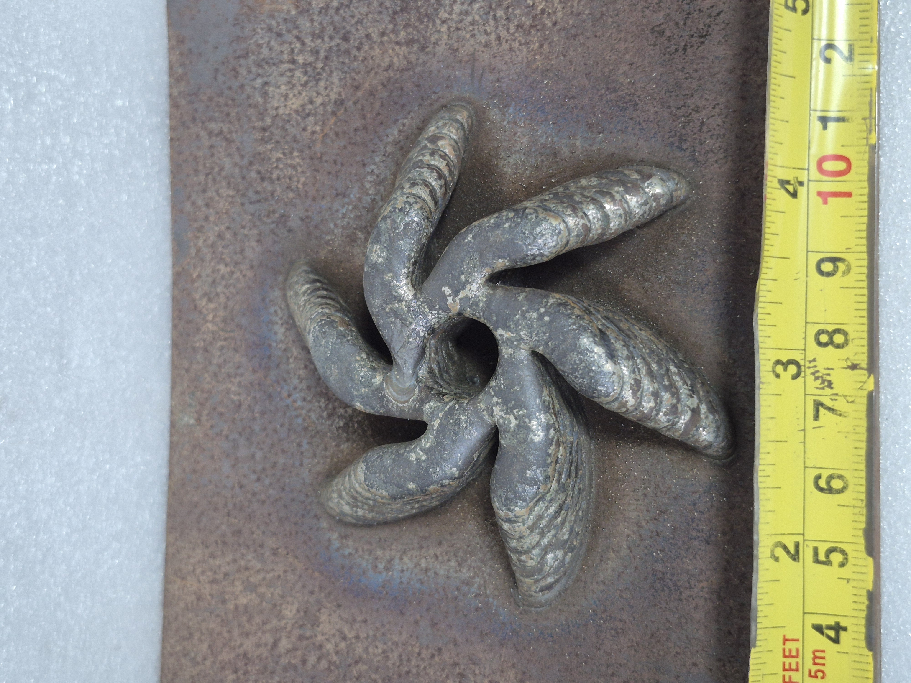
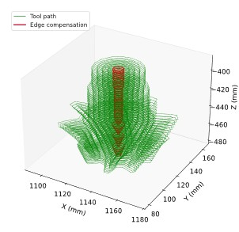
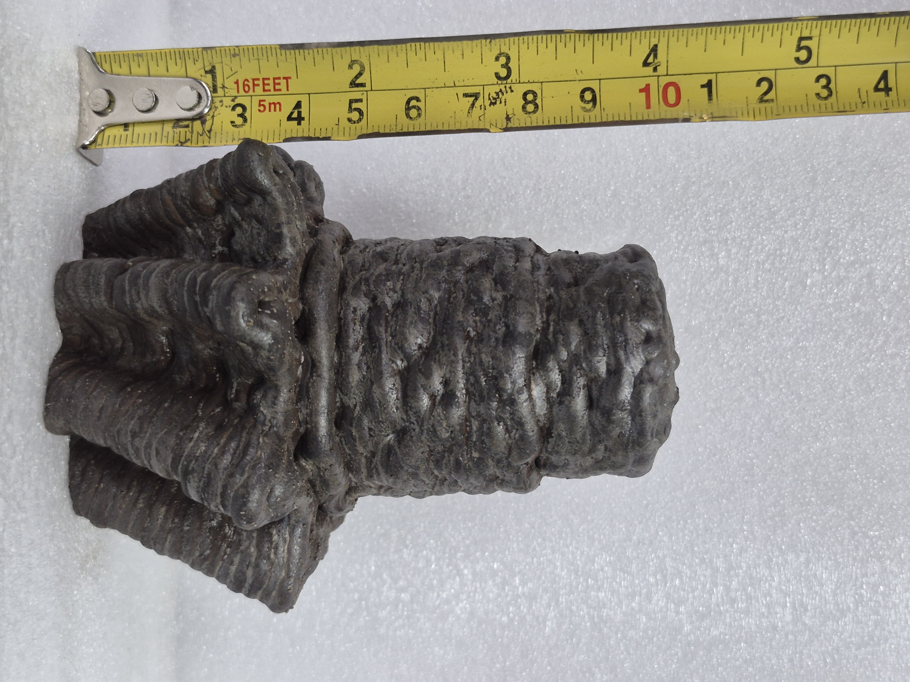
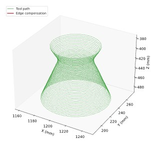
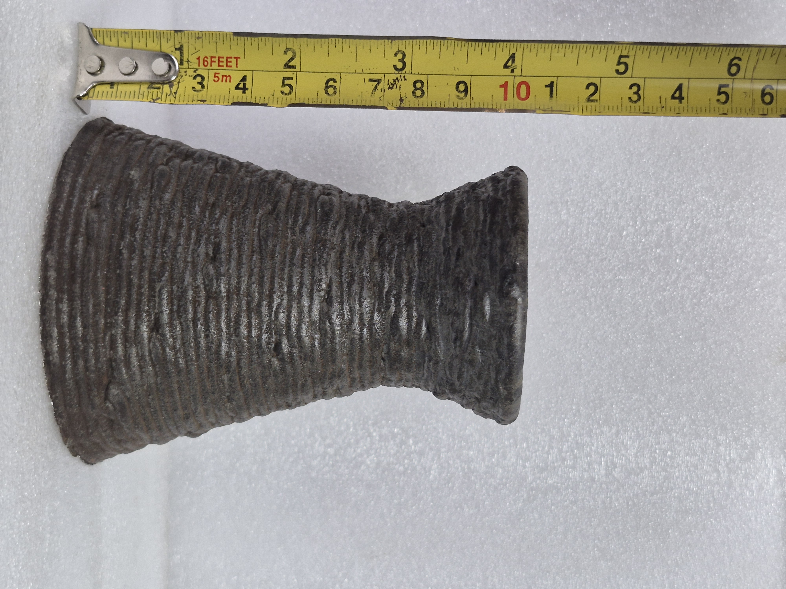

# WAAM Slicer

**Process-aware slicing, path planning, and Fanuc LS generation for Wire Arc Additive Manufacturing (WAAM).**

WAAM Slicer is a Python-based tool that converts STL geometry into WAAM deposition paths and Fanuc R-30iB LS robot programs. The project combines geometric slicing with WAAM-specific process information, including experimentally derived bead geometry, adaptive layer generation, wall/infill planning, torch orientation, and path compensation.

It also includes tools for parsing and visualizing generated LS programs and applying coordinate offsets.

The project is designed as a **research-oriented WAAM path-planning and robot-code preparation tool**, rather than simply an STL slicer.

---

## Key Features

- STL mesh loading and planar slicing
- Geometry analysis and parameter suggestions
- Constant and adaptive layer generation
- Wall / perimeter path planning
- Raster and contour infill
- Configurable bead width and overlap
- Experimental DoE-derived bead height and width model
- Gap / fill-mismatch compensation
- Seam placement and path-order control
- Torch orientation and adaptive tilt
- Fanuc R-30iB LS program generation
- LS parsing and 3D visualization
- Coordinate-offset editing for generated LS programs

---

## Architecture

The overall workflow is:

```text
STL
 │
 ▼
Mesh Loading & Z Alignment
 │
 ▼
Geometry Analysis
 │
 ▼
Layer Generation
 │
 ▼
Horizontal Cross-Sections
 │
 ▼
Wall Path Generation
 │
 ▼
Remaining Interior Region
 │
 ▼
Raster / Contour Infill
 │
 ▼
Gap Compensation & Edge Passes
 │
 ▼
Torch Orientation + Process Data
 │
 ▼
LayerData
 │
 ▼
Fanuc LS Generator
 │
 ▼
.LS Robot Program
 │
 ▼
LS Parser / Visualizer / Offset Editor
```



**Figure.** End-to-end workflow from STL geometry to physical WAAM deposition.

### Project Modules

| File | Responsibility |
|---|---|
| `waam_slicer.py` | Core STL loading, geometry analysis, slicing, wall/infill planning, compensation, torch orientation, and visualization |
| `waam_bead_models.py` | Experimental bead height/width model and interpolation |
| `waam_slicer_ui.py` | Tkinter desktop application and user workflow |
| `waam_ls_generator.py` | Fanuc R-30iB LS program generation |
| `waam_ls_tools.py` | LS parsing, visualization, and coordinate-offset editing |

The main data structure passed from the slicer to the LS generator is `LayerData`, separating geometry/path planning from Fanuc-specific program generation.

---

## Slicing Approach

A central design choice is that **wall paths are generated before infill**.

For each cross-section, the slicer:

1. Generates the wall paths.
2. Determines the region remaining after the walls.
3. Generates raster or contour infill inside that remaining region.
4. Applies gap / mismatch compensation and edge passes where required.
5. Stores the resulting layer as `LayerData`.

This allows the infill to follow the actual remaining material region rather than being generated independently of the walls.

The slicer supports both constant layer heights and adaptive layer schedules.

---

## Experimental Bead Model

`waam_bead_models.py` contains an experimental, DoE-derived model of bead geometry.

The model provides:

- Multilayer bead height as a function of travel speed
- Single-layer bead width as a function of travel speed
- Multilayer bead width as a function of travel speed
- Forward interpolation: speed → bead geometry
- Inverse interpolation: bead geometry → speed

The model is based on experimentally measured data and is intended to be used within its validated operating range rather than extrapolated as a general welding model.

---

## Fanuc LS Generation

The slicer's `LayerData` can be passed to the LS generator to create Fanuc R-30iB LS programs.

The generator handles:

- Travel moves
- Weld start / end commands
- Weld points
- Weld speeds
- Edge-compensation passes
- Tool and frame settings
- Register-based process parameters
- Inter-layer movement
- Point reduction using Douglas-Peucker simplification

The generated LS file can then be loaded back into the project for inspection.

---

## LS Inspection Tools

`waam_ls_tools.py` provides:

- LS parsing
- Motion classification
- Travel / weld / edge-motion visualization
- 3D visualization of generated paths
- X/Y/Z position offsets
- W/P/R orientation offsets

This provides an inspection stage between LS generation and robot-side execution.

---

## Physical Demonstration

The slicer has been used to generate deposition paths and Fanuc R-30iB LS programs for physical WAAM deposition. The examples below show selected geometries from the STL input through generated slicing results to the resulting deposited parts. These examples demonstrate the end-to-end workflow from geometric slicing and path planning to robot-code generation and physical deposition.

| Generated Slices | Physical Deposit |
|---|---|
|  |  |
|  |  |
|  |  |


## Installation

### Requirements

- Python 3.x
- NumPy
- Trimesh
- Shapely
- Matplotlib
- SciPy
- Tkinter

Install the Python dependencies with:

```bash
pip install -r requirements.txt
```

Tkinter is normally included with standard Python installations.

---

## Running the Application

Launch the desktop GUI with:

```bash
python waam_slicer_ui.py
```

The normal workflow is:

1. Select the STL file.
2. Orient the part if required.
3. Analyse the geometry.
4. Configure the slicing and process parameters.
5. Run the slicer.
6. Inspect the generated layers and reports.
7. Generate the Fanuc LS program.
8. Parse and visualize the generated LS file.
9. Independently validate the robot program before physical execution.

---

## Programmatic Use

The core slicer can also be used directly from Python:

```python
from waam_slicer import (
    WAAMSlicer,
    SlicerConfig,
    InfillType
)

config = SlicerConfig(
    layer_height=2.5,
    bead_width=6.0,
    overlap_pct=30.0,
    num_contours=1,
    infill_type=InfillType.RASTER,
)

slicer = WAAMSlicer(config)

slicer.load_stl("part.stl")
slicer.slice()
slicer.print_summary()
```

Fanuc LS generation can then consume the resulting layers:

```python
from waam_ls_generator import LSConfig, LSGenerator

ls_config = LSConfig(
    prog_name="WAAM_PROG",
    uframe=0,
    utool=6,
    travel_speed_val=50.0,
    weld_speed_val=4.0,
    dwell_val=10.0,
    reduction_mode="reduced",
    curve_tolerance_mm=0.5,
)

generator = LSGenerator(ls_config)
generator.save("WAAM_PROG.LS", slicer.layers)
```

---

## Outputs

The project can produce:

- Slice and layer visualizations
- 3D path visualizations
- Geometry analysis information
- Fill-mismatch information
- JSON slice data
- Fanuc R-30iB `.LS` programs
- LS motion visualizations
- Coordinate-offset versions of LS programs
- Physical WAAM deposition examples

Generated `.LS` and `.json` files are excluded from version control by `.gitignore`.

---

## Validation and Limitations

This project is intended for **research and controlled engineering validation**.

Important limitations include:

- The primary slicer is planar and uses horizontal Z-based intersections; it is not a general non-planar slicer.
- Geometry analysis is sampled and approximate.
- Thin-wall centreline extraction is heuristic for complex curved geometries.
- The experimental bead model is derived from experimental data and should not be casually extrapolated beyond its validated range.
- Linear interpolation between measured data points is an approximation rather than a mechanistic weld model.
- The process model does not automatically account for every thermal or process-history effect.
- Generated coordinates are expressed in the STL frame.
- The LS generator does not perform a complete robot-world calibration transform.
- The LS Offset Editor does not perform collision, reachability, or singularity analysis.
- Torch orientation values must be consistent with the actual Fanuc configuration.
- Inter-layer motion assumptions must be validated against the actual welding and wire-retraction setup.

A syntactically valid LS file does not by itself establish that the resulting robot program is safe or that the physical deposition will produce the intended geometry. Generated programs should be independently inspected, simulated or dry-run, and physically validated under controlled conditions before production use.

---

## Documentation

Detailed technical documentation is provided in:

**[WAAM Slicer Documentation](WAAM_Slicer_Documentation.pdf)**

The documentation covers the implementation and workflow in greater detail, including:

- Geometry analysis
- Layer generation
- Adaptive layers
- Experimental bead modelling
- Wall and infill strategies
- Gap / mismatch compensation
- Seam and path ordering
- Torch orientation
- Fanuc LS generation
- LS inspection and coordinate offsets
- Configuration guidance
- Validation considerations
- Troubleshooting
- Developer extension points

---

## Project Structure

```text
WAAM-Slicer/
│
├── README.md
├── WAAM_Slicer_Documentation.pdf
├── requirements.txt
├── .gitignore
│
├── waam_slicer.py
├── waam_bead_models.py
├── waam_slicer_ui.py
├── waam_ls_generator.py
└── waam_ls_tools.py
```

---

## Future Development

Potential extensions include:

- Richer experimental or physics-informed bead models
- Process-aware bead spacing and overlap
- Improved adaptive layer constraints
- Robot reachability and kinematic checks
- Collision and singularity analysis
- Heat-aware path ordering
- Travel-path optimization
- Stronger LS static validation
- Additional robot/controller output formats
- Packaging the core functionality as a reusable Python package

---

## License

This project is released under the MIT License.

See `LICENSE` for details.

---

## Disclaimer

This software is provided as a research and engineering development tool. Robot programs, process parameters, and generated toolpaths must be independently reviewed and validated using the intended robot, welding equipment, tooling, workpiece, and process conditions before physical execution.
